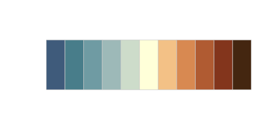
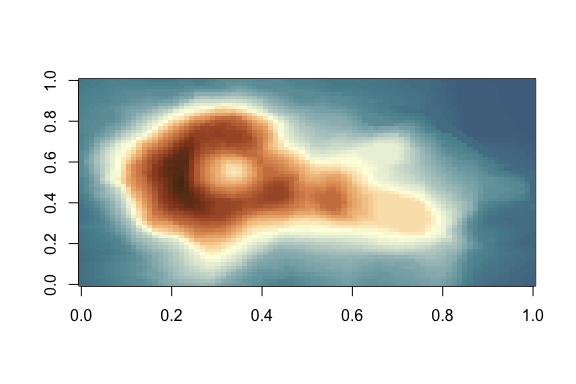
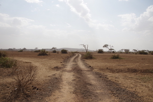
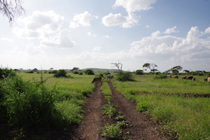
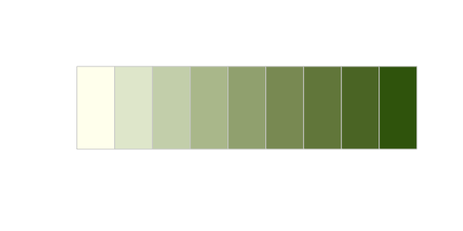

Plotting functions
================

``` r
  library(ramboseli)
```

Custom color palettes
---------------------

Emily and Emily and I talked about how it would be neat to create custom color palettes for plots that are based on dominant hues in photos from Amboseli. I created examples of such palettes based on the photos below, and I added some functions to this package so that you can use them in an R plot.

<br>

#### div\_earthsky

<br> <sub><sup>Photo by [Sergey Pesterev](https://unsplash.com/photos/DWXR-nAbxCk?utm_source=unsplash&utm_medium=referral&utm_content=creditCopyText)</sup></sub>

By default, there are 11 colors:

``` r
make_palette("div_earthsky")
```



It's called `div_earthsky` because it's a *diverging* color palette, which is useful when both low and high values are interesting and there is a meaningful, well-defined midpoint in the data. You can make make smaller palettes like this:

``` r
make_palette("div_earthsky", 5)
```


If you need more than 11 colors, you can use a continuous palette to interpolate between the existing colors:

``` r
pal <- make_palette(name = "div_earthsky", n = 100, type = "continuous")
image(volcano, col = pal)
```



#### seq\_swelling

<br>

``` r
make_palette("seq_swelling")
```


#### seq\_dryseason

<br>

``` r
make_palette("seq_dryseason")
```


#### seq\_wetseason

<br>

``` r
make_palette("seq_wetseason")
```


